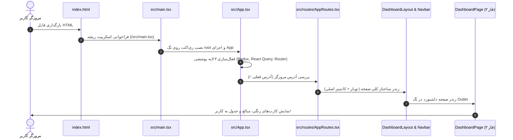

# 🎓 راهنمای جامع و صفر تا صد کدبیس FreelanceOS (تا پایان فاز ۲)

<div dir="rtl">

سلام! این سند اختصاصی برای تو نوشته شده تا وقتی پوشه پروژه‌ات را باز می‌کنی، دقیقاً بدانی **هر فایل کجاست، چرا ساخته شده، و چطور با بقیه اجزا صحبت می‌کند**. 

اگر حس کردی کدها زیاد یا پیچیده هستند، اصلاً نگران نباش! این کاملاً طبیعی است؛ چون این یک پروژه تمرینی ساده نیست، بلکه یک **پروژه با معماری واقعی شرکت‌ها (Enterprise-Grade)** است. در این فایل تمام اجزا را با زبان خودمانی، مرحله‌به‌مرحله و با مثال کالبدشکافی می‌کنیم.

---

## فهرست سرفصل‌ها:
1. **داستان کلی: یک صفحه چطور در مرورگر بالا می‌آید؟ (Execution Flow)**
2. **کالبدشکافی پوشه‌ها: هر پوشه چه کاره است؟ (Folder Structure)**
3. **سیم‌کشی‌ها و اتصالات: اجزا چطور به هم وصل شده‌اند؟ (Wiring & Connections)**
4. **بررسی خط‌به‌خط فایل‌های کلیدی فاز ۲**
5. **پترن‌ها و اصطلاحات عجیبی که در کد دیدی (Glossary of Concepts)**
6. **نکات طلایی برای مصاحبه شغلی**

---

## ۱. داستان کلی: یک صفحه چطور در مرورگر بالا می‌آید؟

وقتی در ترمینال دستور `npm run dev` را می‌زنی و آدرس `http://localhost:5173` را باز می‌کنی، رویدادها دقیقاً به این ترتیب زنجیره‌ای رخ می‌دهند:



### گام به گام چه اتفاقی می‌افتد؟
1. **`index.html`:** مرورگر این فایل را باز می‌کند. در این فایل فقط یک تگ خالی وجود دارد: `<div id="root"></div>` به اضافه لینک فونت‌های گوگل (`Vazirmatn`, `JetBrains Mono`).
2. **`src/main.tsx`:** نقطه شروع جاوااسکریپت. ری‌اکت را برمی‌دارد و می‌گوید: «کامپوننت `<App />` را بگذار داخل همان تگ `root`».
3. **`src/App.tsx`:** نقش **مدیر کل** را دارد. ۳ تا ارائه‌دهنده سرویس (Provider) را مثل لایه‌های پیاز دور برنامه می‌پیچد:
   * `Provider (Redux)`: برای اینکه تمام کامپوننت‌ها به حافظه کلاینت دسترسی داشته باشند.
   * `QueryClientProvider`: برای اینکه همه جا بتوانیم دیتای سرور را کش و واکشی کنیم.
   * `BrowserRouter`: برای اینکه صفحات بدون رفرش مرورگر تغییر کنند (SPA).
4. **`src/routes/AppRoutes.tsx`:** مثل پلیس راهنمایی و رانندگی! می‌بیند آدرس مرورگر `/` است، پس می‌گوید: باید `DashboardLayout` و داخلش `DashboardPage` نشان داده شود.
5. **`src/features/dashboard/DashboardPage.tsx`:** کدهای صفحه داشبورد که در فاز ۲ زدیم اجرا می‌شوند؛ اعداد را حساب می‌کند و کارت‌های رنگی نئوبروتال را نمایش می‌دهد.

---

## ۲. کالبدشکافی پوشه‌ها: هر پوشه چه کاره است؟

ما از معماری **Feature-Driven (ویژگی‌محور)** استفاده کرده‌ایم. یعنی به جای اینکه همه فایل‌ها را در یک پوشه فله‌ای بریزیم، بر اساس نیاز بیزینسی تفکیک کرده‌ایم:

```text
D:\freelance-os\
├── public/                 # فایل‌های استاتیک مثل آیکون سایت (favicon.svg)
├── src/
│   ├── components/         # کامپوننت‌های عمومی و مشترک
│   │   ├── ui/             # اتم‌های طراحی: دکمه، کارت، اینپوت، نشان وضعیت
│   │   └── layout/         # اسکلت اصلی: نوار بالا (Navbar) و لایوت اصلی
│   ├── features/           # بخش‌های بیزنسی پروژه (قلب اپلیکیشن)
│   │   ├── auth/           # ورود و ثبت‌نام
│   │   ├── dashboard/      # پیشخوان، کارت‌های آماری، چارت‌ها (فاز ۲)
│   │   ├── invoices/       # جدول فاکتورها، صدور فاکتور و برگه چاپ
│   │   ├── clients/        # لیست مشتریان و فرم ثبت مشتری
│   │   └── projects/       # لیست پروژه‌ها و قراردادها
│   ├── hooks/              # هوک‌های عمومی و کمکی
│   ├── lib/                # پیکربندی ابزارهای خارجی (کلاینت Supabase، توابع کمکی)
│   ├── routes/             # قوانین رفت‌وآمد بین صفحات (React Router)
│   ├── store/              # مخزن مرکزی حافظه کلاینت (Redux Toolkit)
│   └── types/              # شناسنامه تایپ‌ها و اینترفیس‌های داده‌ها (TypeScript)
```

### چرا پوشه `features/` جداست؟
اگر فردا بخواهی بخش «مشتریان» را ویرایش کنی، لازم نیست در کل پروژه بچرخی؛ کافی است وارد پوشه `src/features/clients` بشوی. همه‌چیز مشتریان (فرم، دکمه، هوک فچ دیتا، سرویس ارتباط با دیتابیس) دقیقاً همان‌جاست. این تمیزترین استاندارد توسعه در شرکت‌های بزرگ است.

---

## ۳. سیم‌کشی‌ها و اتصالات: اجزا چطور با هم صحبت می‌کنند؟

### ۱. اتصال دیزاین نئوبروتالیسم به کامپوننت‌ها (Tailwind Wiring):
* ما در فایل `tailwind.config.js` کلمات جادویی مثل `retro-yellow` و `shadow-retro` را تعریف کردیم.
* وقتی در کامپوننت می‌نویسیم:
  ```html
  <div class="border-2 border-black bg-retro-yellow shadow-retro rounded-2xl">
  ```
  تیلویند خودکار حاشیه ضخیم مشکی (`#000000`)، رنگ زرد موزی (`#FFE600`) و سایه سخت ۴ پیکسلی بدون بلر (`4px 4px 0px #000`) را روی آن المنت اعمال می‌کند!

### ۲. اتصال کامپوننت‌های پایه با کتابخانه CVA:
در فایل `src/components/ui/button.tsx` از ابزاری به نام `class-variance-authority` (یا به اختصار cva) استفاده کردیم.
* **کار CVA چیست؟** به تو اجازه می‌دهد یک دکمه بسازی که رنگ‌ها و اندازه‌های مختلف بگیرد بدون اینکه صد تا شرط `if-else` بنویسی:
  ```tsx
  <Button variant="default">صدور فاکتور (زرد)</Button>
  <Button variant="secondary">مشتری جدید (سبز نعنایی)</Button>
  <Button variant="destructive">حذف فاکتور (صورتی)</Button>
  ```

### ۳. اتصال React Query به دیتابیس و نمایش در داشبورد:
ارتباط دیتا چطور برقرار می‌شود؟
1. فایل `invoiceService.ts`: متدی دارد که دیتا را از Supabase (یا حافظه موقت محلی) می‌خواند.
2. فایل `useInvoices.ts`: هوکی دارد که تابع بالا را به `useQuery` تحویل می‌دهد:
   ```ts
   export const useInvoices = () => {
     return useQuery({
       queryKey: ['invoices'], // کلید برای اینکه ری‌اکت کوئری دیتا را در کش نگه دارد
       queryFn: invoiceService.getInvoices,
     });
   };
   ```
3. کامپوننت `DashboardPage.tsx`: این هوک را صدا می‌زند:
   ```tsx
   const { data: invoices = [] } = useInvoices();
   ```
   دیتای فاکتورها فوراً داخل متغیر `invoices` قرار می‌گیرد؛ بدون اینکه نیاز باشد دستی `useEffect` یا `useState` و کدهای ارور و لودینگ بنویسی!

---

## ۴. بررسی خط‌به‌خط فایل‌های کلیدی فاز ۲

بیایید فایل‌هایی که در فاز ۲ اجرا شدند را موشکافی کنیم:

### الف) فایل `src/components/layout/Navbar.tsx`
این همان نوار بالای صفحه است که لوگو و لینک‌ها را دارد:
* **`NavLink`:** به جای تگ ساده `<a>` از کامپوننت `NavLink` ری‌اکت روتر استفاده کردیم. خاصیت `isActive` به ما می‌گوید کاربر الان در کدام صفحه است تا به آن تب رنگ زرد و سایه بدهیم.
* **دکمه‌های اقدام:** دکمه «+ صدور فاکتور جدید» مستقیماً به آدرس `/invoices/new` لینک شده است.
* **بج کاربر:** نام کاربر را با حرف اول اسمش در یک دایره کوچک سبز نعنایی نشان می‌دهد.

### ب) فایل `src/features/dashboard/DashboardPage.tsx`
قلب تپنده فاز ۲ که در مرورگر دیدی! این فایل از ۴ بخش تشکیل شده است:

1. **بخش محاسبات در ابتدای فایل:**
   ```tsx
   const paidInvoices = invoices.filter((i) => i.status === 'paid');
   const totalPaidRevenue = paidInvoices.reduce((sum, i) => sum + i.total_amount, 0);
   ```
   * متد `filter`: فقط فاکتورهایی که وضعیتشان `paid` (پرداخت شده) است را جدا می‌کند.
   * متد `reduce`: مبالغ تمام فاکتورهای پرداخت‌شده را با هم جمع می‌زند تا جمع کل درآمد حاصل شود.
2. **بنر خوش‌آمدگویی (Hero Banner):** تابلوی بالایی که پیام «خوش آمدید، الکس ⚡» و فیلتر ماهانه دارد.
3. **گرید ۴ تایی کارت‌های KPI:**
   * کارت سبز نعنایی: درآمد وصول شده.
   * کارت زرد: مطالبات در انتظار وصول.
   * کارت یاسی: پروژه‌های جاری.
   * کارت صورتی: مشتریان فعال.
   * همه کارت‌ها با فرمت پول فارسی (`formatPrice`) مبالغ را نمایش می‌دهند (مثلاً: `۱۲۴,۵۰۰,۰۰۰ تومان`).
4. **جدول فاکتورهای اخیر (Recent Invoices Table):**
   * ۵ فاکتور آخر را از آرایه برمی‌دارد (`invoices.slice(0, 5)`).
   * نام شرکت، پروژه، سررسید و مبلغ را در ردیف‌های جدول چاپ می‌کند.
   * نشان‌های وضعیت کپسولی (`Badge`) را بر اساس وضعیت فاکتور رنگ‌آمیزی می‌کند.

---

## ۵. پترن‌ها و اصطلاحات عجیبی که در کد دیدی!

اگر کدهایی دیدی که در دوره آموزشیت هنوز به آنها نرسیده‌ای، معنی‌شان این است:

### ۱. مفهوم `forwardRef` چیست؟
در فایل‌های مثل `button.tsx` یا `input.tsx` دیدی که نوشته شده:
```tsx
export const Button = React.forwardRef<HTMLButtonElement, ButtonProps>(...)
```
* **توضیح ساده:** در حالت عادی اگر به یک کامپوننت شخصی‌ساز ری‌اکت یک `ref` پاس بدهی (برای فوکوس کردن با ماوس یا انیمیشن)، ری‌اکت ارور می‌دهد. با `forwardRef` ما اجازه می‌دهیم این کامپوننت رفرنس عنصر HTML واقعی زیرین خود را بدون واسطه منتقل کند. این یک استاندارد در کتابخانه‌های سطح بالا مثل shadcn است.

### ۲. تابع `cn(...)` چیست؟ (`src/lib/utils.ts`)
```tsx
export function cn(...inputs: ClassValue[]) {
  return twMerge(clsx(inputs));
}
```
* **توضیح ساده:** این تابع ترکیب دو پکیج است:
  * `clsx`: برای فعال کردن کلاس‌های شرطی (مثلاً اگر ارور داشت این کلاس را بگذار).
  * `tailwind-merge`: حل تداخل کلاس‌های تیلویند! اگر در یک جا نوشتی `p-4` و جای دیگر نوشتی `p-6`، هوشمندانه `p-6` را اعمال می‌کند تا تداخل استایل رخ ندهد.

### ۳. مفهوم `<Outlet />` چیست؟
در فایل `DashboardLayout.tsx` دیدی که نوشته شده:
```tsx
<Navbar />
<main>
  <Outlet />
</main>
<footer />
```
* **توضیح ساده:** تگ `<Outlet />` مثل یک پنجره خالی است! می‌گوید نوبار بالا و فوتر پایین همیشه ثابت بمانند، و هر صفحه‌ای که کاربر به آن رفت (داشبورد، فاکتورها، تنظیمات) بیاید و درست وسط این پنجره نشان داده شود.

---

## ۶. اگر در مصاحبه شغلی پرسیدند، چه بگویی؟

> **سوال مصاحبه‌کننده:** «معماری بخش پیشخوان و استیت‌های آن را توضیح بده.»
> **پاسخ آماده تو:**
> «من داشبورد را با معماری Feature-Driven پیاده کردم. داده‌های فاکتورها، مشتریان و پروژه‌ها توسط هوک‌های اختصاصی React Query از سرور کش می‌شوند. در کامپوننت داشبورد، شاخص‌های کلیدی مثل مجموع درآمد تسویه‌شده و مطالبات معوق، به صورت مشتق‌شده (Derived State) و با توابع خالص `filter` و `reduce` در حافظه کلاینت محاسبه می‌شوند. این کار باعث شده که سرعت لود آنی و بدون تأخیر باشد، و با هر تغییر در دیتابیس (مثلاً ثبت وصول فاکتور)، کل داشبورد به صورت اتوماتیک به‌روزرسانی شود.»

---

## 🎯 نتیجه‌گیری: الان کجای کاریم؟
ما تا الان:
* زیرساخت دیزاین‌سیستم نئوبروتالیسم را ساختیم (فاز ۱).
* لایوت اصلی، نوبار، فوتر و صفحه کامل پیشخوان را بالا آوردیم (فاز ۲).
* کدهایت تمیز، کامپایل‌شده با بیلد پروداکشن، ۱۰۰٪ فارسی و آماده رفتن به **فاز ۳ (صفحه جدول و فیلتر فاکتورها)** است.

این فایل برای همیشه در مسیر `D:\freelance-os\PHASE_2_EXPLAINED.md` برایت ذخیره شده است. هر زمان آماده بودی، بگو تا فاز ۳ را شروع کنیم!

</div>
