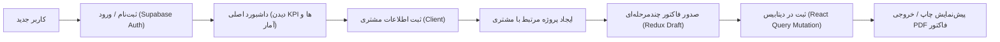
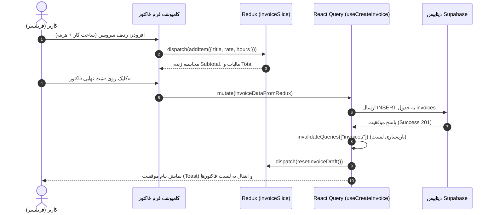

# 🚀 سند معماری و نقشه راه جامع پروژه FreelanceOS

<div dir="rtl">

این سند راهنمای کامل، معماری، نحوه پیاده‌سازی و استراتژی فنی پروژه **FreelanceOS** است. این سند طوری طراحی شده که هم به عنوان یک مرجع گام‌به‌گام در زمان توسعه استفاده شود و هم در زمان آمادگی برای نمایشگاه کار و مصاحبه‌های فنی، به عنوان **شناسنامه و دفترچه راهنمای پروژه** در کنارت باشد.

---

## ۱. داستان بیزینسی و جریان کاربری (User Journey)

### هدف محصول
**FreelanceOS** یک پنل مدیریت پروژه‌ها، مشتریان و صدور آنلاین فاکتور برای متخصصان، فریلنسرها و آژانس‌های کوچک است.

### جریان کاربر در نرم‌افزار


---

## ۲. ساختار کامل پوشه‌ها و فایل‌ها (Folder Architecture)

ما از ساختار مدرن **Feature-Driven / Modular** استفاده می‌کنیم؛ یعنی هر بخش بزرگ اپلیکیشن (مثل مشتریان، فاکتورها، احراز هویت) ماژول و هوک‌های خودش را دارد:

```text
freelance-os/
├── public/                       # فایل‌های استاتیک، آیکون‌ها و لوگو
├── src/
│   ├── assets/                   # تصاویر و فونت‌ها
│   ├── components/               # کامپوننت‌های عمومی و قابل استفاده مجدد
│   │   ├── ui/                   # کامپوننت‌های shadcn/ui (Button, Dialog, Table, Badge, ...)
│   │   ├── layout/               # قالب‌های اپلیکیشن (Sidebar, Navbar, DashboardLayout)
│   │   └── common/               # لودینگ‌ها، مودال تایید حذف، کامپوننت‌های ارور
│   ├── features/                 # ماژول‌های بیزنسی پروژه
│   │   ├── auth/                 # ورود، ثبت‌نام و محافظت از صفحات
│   │   │   ├── components/       # فرم ورود و ثبت‌نام
│   │   │   ├── hooks/            # هوک useAuth برای مدیریت سشن
│   │   │   └── services/         # ارتباط مستقیم با متدهای Supabase Auth
│   │   ├── dashboard/            # صفحه آمار و دید کلی
│   │   │   └── components/       # کارت‌های درآمد، تعداد فاکتورها و چارت ساده
│   │   ├── clients/              # بخش مدیریت مشتریان
│   │   │   ├── components/       # لیست مشتریان، فرم افزودن/ویرایش مشتری
│   │   │   └── hooks/            # هوک‌های React Query (useClients, useCreateClient)
│   │   ├── projects/             # بخش پروژه‌ها
│   │   │   ├── components/       # کارت‌های پروژه‌ها و فرم وضعیت
│   │   │   └── hooks/            # هوک‌های React Query پروژه‌ها
│   │   └── invoices/             # قلب تپنده پروژه (سیستم فاکتور)
│   │       ├── components/       # جدول فاکتورها، فرم سازنده فاکتور، برگه پرینت
│   │       ├── hooks/            # هوک‌های فچ و ذخیره فاکتور در سرور
│   │       └── invoiceSlice.ts   # اسلایس Redux برای محاسبات آنی پیش‌نویس فاکتور
│   ├── hooks/                    # هوک‌های سراسری عمومی (useToast, useTheme)
│   ├── lib/                      # کانفیگ‌ها و کلاینت‌ها
│   │   ├── supabase.ts           # مقداردهی اولیه کلاینت Supabase با متغیرهای محیطی
│   │   └── utils.ts              # توابع کمکی (مثل cn برای ترکیب کلاس‌های Tailwind)
│   ├── routes/                   # ساختار مسیریابی
│   │   ├── AppRoutes.tsx         # تعریف Routeها (Nested Routes و Protected Routes)
│   │   └── ProtectedRoute.tsx    # گارد امنیتی جلوگیری از ورود کاربران لاگین‌نکرده
│   ├── store/                    # مدیریت استیت سراسری کلاینت (Redux Toolkit)
│   │   ├── index.ts              # ساخت استور مرکزی ریداکس
│   │   └── uiSlice.ts            # استیت سایدبار، وضعیت باز/بسته بودن مودال‌ها، تم
│   ├── types/                    # تعاریف تایپ‌های داده‌ها (TypeScript Interfaces)
│   │   └── database.types.ts     # اینترفیس‌های جداول دیتابیس Supabase
│   ├── App.tsx                   # کامپوننت ریشه با پرووایدرهای QueryClient و Redux
│   ├── main.tsx                  # نقطه ورودی برنامه
│   └── index.css                 # استایل‌های سراسری، فونت فارسی و متغیرهای رنگی
├── .env.example                  # نمونه متغیرهای کلید Supabase
├── package.json                  # لیست وابستگی‌ها و اسکریپت‌ها
├── tailwind.config.js            # کانفیگ Tailwind و انیمیشن‌ها
├── tsconfig.json                 # تنظیمات تایپ‌اسکریپت
└── vite.config.ts                # کانفیگ سریع Vite
```

---

## ۳. تفکیک نقش ابزارها (چه ابزاری چه کاری انجام می‌دهد؟)

این بخش همان **کلید موفقیت در مصاحبه** است:

| ابزار | مسئولیت در پروژه | نمونه عملی در FreelanceOS |
| :--- | :--- | :--- |
| **React + Vite** | هسته ساخت رابط کاربری تک‌صفحه‌ای (SPA) با سرعت اجرای بالا | رندر کامپوننت‌ها و کنترل چرخه حیات UI |
| **React Router (v6/v7)** | مدیریت صفحات، جابه‌جایی بدون رفرش، و ساخت مسیرهای محافظت‌شده | هدایت کاربر لاگین‌نکرده به `/login` و دسترسی به `/dashboard` و `/invoices` |
| **TanStack React Query** | **مدیریت استیت سرور (Server State):** واکشی، کشینگ، به‌روزرسانی خودکار دیتابیس | گرفتن لیست فاکتورها، کش ۳۰ دقیقه‌ای آنها، و باطل‌سازی خودکار کش (Invalidation) پس از حذف |
| **Redux Toolkit** | **مدیریت استیت کلاینت (Client State):** داده‌های موقت، تعاملی و در حال ویرایش | فرم فاکتورساز: اضافه/کم کردن ردیف‌های خدمات، محاسبه مالیات و تخفیف قبل از ارسال به سرور |
| **Supabase** | Backend-as-a-Service: شامل دیتابیس PostgreSQL، احراز هویت و ذخیره فایل | دیتابیس فاکتورها + سیستم ورود/خروج امن با ایمیل + سیاست‌های Row-Level Security (RLS) |
| **Tailwind CSS + shadcn/ui** | دیزاین‌سیستم مدرن و کامپوننت‌های به شدت استاندارد و قابل دسترسی | جدول‌های داده، دیالوگ‌های پاپ‌آپ، نشانگرهای وضعیت رنگی، و پشتیبانی دارک‌مود |

---

## ۴. معماری جریان داده (Data Flow)

جریان اضافه شدن یک فاکتور جدید و نحوه تعامل Redux و React Query:



> [!NOTE]
> **چرا این جریان داده استاندارد است؟**
> کاربر تا زمانی که روی دکمه ثبت نهایی کلیک نکرده، هیچ ترافیک یا درخواست بیهوده‌ای به سرور نمی‌زند. تمام محاسبات در حافظه کلاینت (Redux) انجام می‌شود. به محض ثبت، بار داده به React Query و Supabase منتقل شده و کش قدیمی در کسری از ثانیه آپدیت می‌شود.

---

## ۵. شماتیک دیتابیس Supabase (Database Schema)

در Supabase چهار جدول اصلی تعریف می‌کنیم:

1. **`profiles`**: اطلاعات پروفایل فریلنسر (نام، نام شرکت، شماره کارت/حساب، لوگو).
2. **`clients`**: مشتریان (نام، شماره تماس، ایمیل، آدرس).
3. **`projects`**: پروژه‌ها (عنوان، شناسه مشتری `client_id`، بودجه، وضعیت).
4. **`invoices`**: فاکتورها (شماره فاکتور، شناسه پروژه، تاریخ، سررسید، وضعیت: `draft` / `pending` / `paid`، جمع کل).
5. **`invoice_items`**: ردیف‌های داخل هر فاکتور (شرح کار، تعداد/ساعت، قیمت واحد، قیمت ردیف).

### اصل حیاتی امنیت: Row-Level Security (RLS)
> [!IMPORTANT]
> در دیتابیس Supabase قانونی تنظیم می‌کنیم که:
> `auth.uid() = user_id`
> این یعنی حتی اگر یک هکر توکن لاگین دیگری را داشته باشد، موتور PostgreSQL در Supabase اجازه نمی‌دهد کاربری فاکتورها یا مشتریان کاربر دیگری را ببیند. این یک مبحث فوق‌العاده مهم در مصاحبه‌ها است!

---

## ۶. مراحل اجرایی پیاده‌سازی (Roadmap)

### فاز ۱: ستاپ پروژه و زیرساخت (Setup & Config)
* ساخت پروژه با Vite و TypeScript در مسیر پروژه
* نصب پکیج‌ها: React Router, Redux Toolkit, React Query, Lucide Icons, Tailwind CSS, shadcn/ui
* تنظیم کلاینت Supabase و فایل `.env`

### فاز ۲: احراز هویت و امنیت (Auth & Routing)
* ساخت صفحات لاگین و ثبت‌نام با فرم‌های شیک
* پیاده‌سازی `ProtectedRoute` برای محافظت از داشبورد
* ذخیره توکن سشن کاربر و ریدایرکت خودکار

### فاز ۳: استیت کلاینتی و ریداکس (Redux Store)
* ساخت `uiSlice` برای تنظیمات باز و بسته بودن منو و تم
* ساخت `invoiceSlice` برای محاسبات در لحظه ساخت فاکتور (افزودن ردیف، درصد مالیات، تخفیف، جمع نهایی)

### فاز ۴: لایه واکشی سرور (React Query Hooks)
* ساخت Custom Hookها برای خواندن و نوشتن اطلاعات (`useInvoices`, `useClients`, `useProjects`)
* اضافه کردن قابلیت Invalidation کش تا بعد از ساخت/حذف فاکتور، جدول به صورت خودکار بدون رفرش دستی آپدیت شود.

### فاز ۵: رابط کاربری و صفحات (UI & Pages)
* پیاده‌سازی لایوت اصلی با سایدبار ریسپانسیو
* صفحه داشبورد (خلاصه وضعیت مالی، کارت‌های کلیدی)
* صفحه و جدول فاکتورها با قابلیت تغییر وضعیت به «پرداخت شده»
* صفحه فرم ساخت فاکتور و مشاهده پیش‌نمایش برگه استاندارد A4 برای چاپ

### فاز ۶: دفترچه راهنمای آموزشی هر بخش (Learning Docs)
* ایجاد فایل‌های متنی آموزشی در پوشه `docs/` پروژه تا قدم‌به‌قدم کدها را مرور کنی.

---

## ۷. راهنمای طلایی دفاع در مصاحبه (Interview Defense Cheat Sheet)

اگر در مصاحبه نمایشگاه کار یا شرکت‌ها این سوالات را پرسیدند، این پاسخ‌های تخصصی را بده:

#### س: «چرا هم Redux استفاده کردی هم React Query؟ مگر ریداکس نمی‌توانست دیتا را فچ کند؟»
> **پاسخ:** «ریداکس برای نگهداری **Client State** عالی است (مثل داده‌های محاسباتی موقت فرم فاکتور، سایدبار و تم). اما سرور استیت ویژگی‌های متفاوتی مثل کشینگ، جلوگیری از درخواست‌های تکراری، مدیریت لودینگ، خطایابی خودکار و Invalidation دارد. به کار بردن React Query برای سرور استیت باعث شد حجم کدهای ریداکس به شدت کاهش یابد و منطق برنامه بسیار تمیزتر و تفکیک‌شده‌تر شود.»

#### س: «امنیت دیتا چطور حفظ می‌شود وقتی کلاینت مستقیم به دیتابیس وصل است؟»
> **پاسخ:** «ما از قابلیت **Row Level Security (RLS)** در سطح دیتابیس PostgreSQL در Supabase استفاده کردیم. تمام کوئری‌ها به صورت سخت‌گیرانه شرط `user_id = auth.uid()` دارند، بنابراین حتی در صورت دستکاری کدهای فرانت‌اند، سرور اجازه خواندن یا نوشتن اطلاعات غیرمجاز را نمی‌دهد.»

#### س: «چرا shadcn/ui را به ابزارهایی مثل Ant Design یا MUI ترجیح دادی؟»
> **پاسخ:** «چون shadcn یک پکیج سنگین با وابستگی‌های غیرقابل تغییر نیست؛ بلکه کدهای کامپوننت مستقیماً در سورس پروژه کپی می‌شوند و با Tailwind کاملاً قابل شخصی‌سازی، سبک و دسترسی‌پذیر (Accessible بر پایه Radix UI) هستند.»

</div>
